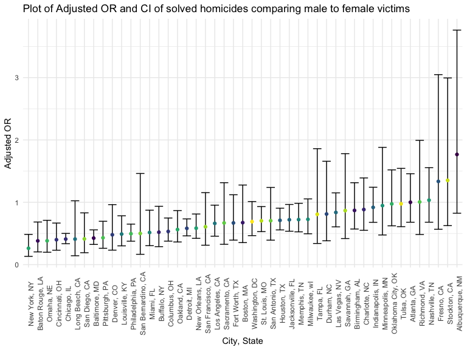

HW6
================

### Load packages and initial setup

``` r
library(tidyverse)
library(p8105.datasets)
library(mgcv)
library(modelr)
library(viridis)
knitr::opts_chunk$set(
    echo = TRUE,
    warning = FALSE,
    fig.width = 8, 
  fig.height = 6,
  out.width = "90%"
)
options(
  ggplot2.continuous.colour = "viridis",
  ggplot2.continuous.fill = "viridis"
)
scale_colour_discrete = scale_colour_viridis_d
scale_fill_discrete = scale_fill_viridis_d
theme_set(theme_minimal() + theme(legend.position = "bottom"))
```

## Question 1

## Question 2

Import data. Create variables `city_state`, `solved` indicator variable.

``` r
post <- read_csv("https://raw.github.com/washingtonpost/data-homicides/master/homicide-data.csv") %>%
  janitor::clean_names() %>%
  mutate(city_state = paste(city, state, sep =  ", "),
         solved = ifelse(disposition == "Closed by arrest", 1, 0),
         victim_age = as.numeric(recode(victim_age, "Unknown" = ""))) %>%
  filter((city_state != "Tulsa, AL" & city_state != "Dallas, TX" & city_state != "Phoenix, AZ" & city_state != "Kansas City, MO") & (victim_race == "White" | victim_race == "Black")) %>%
  select(city_state, everything())
```

    ## Rows: 52179 Columns: 12
    ## ── Column specification ────────────────────────────────────────────────────────
    ## Delimiter: ","
    ## chr (9): uid, victim_last, victim_first, victim_race, victim_age, victim_sex...
    ## dbl (3): reported_date, lat, lon
    ## 
    ## ℹ Use `spec()` to retrieve the full column specification for this data.
    ## ℹ Specify the column types or set `show_col_types = FALSE` to quiet this message.

Fit logistic regression model using `glm`. `solved` is the outcome and
`victim_age`, `victim_sex`, and `victim_race` are predictors.

Among homicides in Baltimore, MD

``` r
fit <-
  post %>%
  filter(city_state == "Baltimore, MD") %>%
  glm(solved ~ victim_age + victim_sex + victim_race, family = binomial (link = "logit"), data = .)

fit %>%
  broom::tidy(conf.int = TRUE) %>%
  mutate(OR = exp(estimate), 
         OR_conf_low = exp(conf.low), 
         OR_conf_high = exp(conf.high)) %>%
  select(term, log_OR = estimate, OR, OR_conf_low, OR_conf_high) %>%
  knitr::kable(digits = 3)
```

| term             | log_OR |    OR | OR_conf_low | OR_conf_high |
|:-----------------|-------:|------:|------------:|-------------:|
| (Intercept)      |  0.310 | 1.363 |       0.976 |        1.911 |
| victim_age       | -0.007 | 0.993 |       0.987 |        1.000 |
| victim_sexMale   | -0.854 | 0.426 |       0.324 |        0.558 |
| victim_raceWhite |  0.842 | 2.320 |       1.650 |        3.276 |

Among all cities

``` r
model_func <- function(x){
  glm(solved ~ victim_age + victim_sex + victim_race, family = binomial (link = "logit"), data = x) %>%
  broom::tidy(conf.int = TRUE) %>%
  mutate(OR = exp(estimate), 
         OR_conf_low = exp(conf.low), 
         OR_conf_high = exp(conf.high)) %>%
  select(term, log_OR = estimate, OR, OR_conf_low, OR_conf_high) %>%
  filter(term == "victim_sexMale")
}

all_nest <-
  post %>%
  nest(data = -city_state) %>%
  mutate(est = map(data, model_func)) %>%
  unnest(est)
```

Plot showing estimated ORs and CIs for each city, organizing cities
according to estimated OR.

``` r
all_nest %>%
  ggplot(aes(reorder(city_state, OR), OR)) +
  geom_errorbar(aes(min = OR_conf_low, max = OR_conf_high)) +
  geom_point(aes(color = city_state)) +
  labs(
    title = "Plot of Adjusted OR and CI of solved homicides comparing male to female victims",
    x = "City, State",
    y = "Adjusted OR"
  ) +
  theme(axis.text.x = element_text(angle = 90),
        legend.position = "none")
```



From the plot, on average, the adjusted ORs for most cities are below 1,
suggesting that male victims have a smaller odds of having a solved
homicide case compared to females. Additionally, we see the confidence
interval for many cities contains the null value of 1, indicating
results are not significant.

## Question 3

``` r
weight <-
  read.csv("data/birthweight.csv") %>%
  mutate(id = row_number(),
         babysex = as.factor(babysex),
         frace = as.factor(frace),
         mrace = as.factor(mrace),
         malform = as.factor(malform))
```

``` r
str(weight)
```

    ## 'data.frame':    4342 obs. of  21 variables:
    ##  $ babysex : Factor w/ 2 levels "1","2": 2 1 2 1 2 1 2 2 1 1 ...
    ##  $ bhead   : int  34 34 36 34 34 33 33 33 36 33 ...
    ##  $ blength : int  51 48 50 52 52 52 46 49 52 50 ...
    ##  $ bwt     : int  3629 3062 3345 3062 3374 3374 2523 2778 3515 3459 ...
    ##  $ delwt   : int  177 156 148 157 156 129 126 140 146 169 ...
    ##  $ fincome : int  35 65 85 55 5 55 96 5 85 75 ...
    ##  $ frace   : Factor w/ 5 levels "1","2","3","4",..: 1 2 1 1 1 1 2 1 1 2 ...
    ##  $ gaweeks : num  39.9 25.9 39.9 40 41.6 ...
    ##  $ malform : Factor w/ 2 levels "0","1": 1 1 1 1 1 1 1 1 1 1 ...
    ##  $ menarche: int  13 14 12 14 13 12 14 12 11 12 ...
    ##  $ mheight : int  63 65 64 64 66 66 72 62 61 64 ...
    ##  $ momage  : int  36 25 29 18 20 23 29 19 13 19 ...
    ##  $ mrace   : Factor w/ 4 levels "1","2","3","4": 1 2 1 1 1 1 2 1 1 2 ...
    ##  $ parity  : int  3 0 0 0 0 0 0 0 0 0 ...
    ##  $ pnumlbw : int  0 0 0 0 0 0 0 0 0 0 ...
    ##  $ pnumsga : int  0 0 0 0 0 0 0 0 0 0 ...
    ##  $ ppbmi   : num  26.3 21.3 23.6 21.8 21 ...
    ##  $ ppwt    : int  148 128 137 127 130 115 105 119 105 145 ...
    ##  $ smoken  : num  0 0 1 10 1 0 0 0 0 4 ...
    ##  $ wtgain  : int  29 28 11 30 26 14 21 21 41 24 ...
    ##  $ id      : int  1 2 3 4 5 6 7 8 9 10 ...

``` r
sapply(weight, function(x) sum(is.na(x)))
```

    ##  babysex    bhead  blength      bwt    delwt  fincome    frace  gaweeks 
    ##        0        0        0        0        0        0        0        0 
    ##  malform menarche  mheight   momage    mrace   parity  pnumlbw  pnumsga 
    ##        0        0        0        0        0        0        0        0 
    ##    ppbmi     ppwt   smoken   wtgain       id 
    ##        0        0        0        0        0

No missing values in dataset, `id` variable created, `babysex`, `frace`,
`mrace`, and `malform` converted to factor variables.
